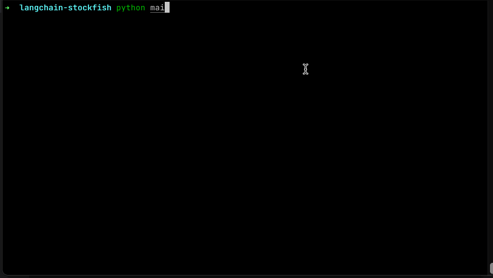

# langchain-stockfish

langchain-stockfish is an experimental project that creates a custom chess player [Agent](https://python.langchain.com/en/latest/modules/agents.html) and Stockfish [Tool](https://python.langchain.com/en/latest/modules/agents/tools.html) to facilitate chess playing capabilities for an LLM. **Note: This project is for experimental use only and I have no intention of maintaining this project**.



## Installation and running

**Prerequisites:** Make sure that `OPENAI_API_KEY` is accessible as an environment variable

```sh
# Install stockfish, and copy, move or link the binary to the stockfish_binary folder
brew install stockfish
cp /opt/homebrew/Cellar/stockfish/15.1/bin/stockfish ./stockfish_binary

pip install -r requirements.txt
python main.py
```
